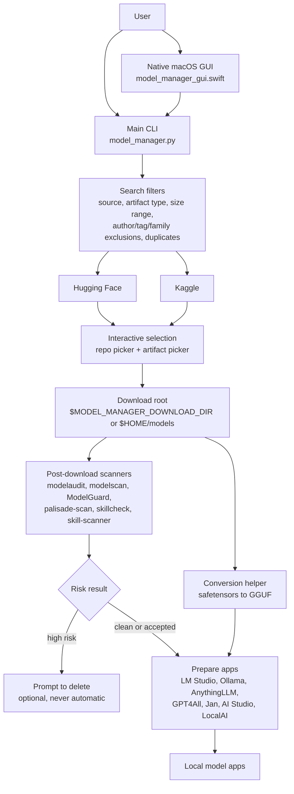

# System Overview

This sketch shows how the public Model Manager tools fit together. The design goal is simple: search broadly, download selected artifacts to disk, scan them before use, and keep destructive actions explicit.

## Notes

- `model_manager.py` is the source of truth for search, filtering, selection, download, scanner orchestration, and follow-up prompts.
- `model_manager_gui.swift` is a native macOS front end. It does not start a web server, bind a local port, or use Docker.
- Search supports Hugging Face, Kaggle, or both, then narrows results by artifact type, artifact size, author or publisher exclusions, tag or term exclusions, model family exclusions, and duplicate-family hiding.
- Downloads are written to the configured download root before scanner execution. The model file is not kept in memory for the whole scan.
- Scanner repositories are installed locally by the user and ignored by Git. The public repo documents how to clone them, but does not vendor their source trees or virtual environments.
- Delete actions are intentionally user-confirmed. A scanner finding can trigger a delete prompt, but the manager should not silently remove downloaded files.
- Preparation scripts register or link downloaded models into local model apps after the audit path has run.
- `model_conversion.py` handles safetensors-to-GGUF conversion and can hand converted artifacts back to the prepare workflow.

## Repository Boundaries

- Public source files, README, requirements, and helper scripts are committed.
- Local scanner checkouts, model artifacts, logs, archives, spreadsheets, chat exports, binary tools, and caches are ignored.
- Use environment variables for machine-specific locations, especially `MODEL_MANAGER_DOWNLOAD_DIR` and `MODEL_MANAGER_TOOLS_DIR`.
